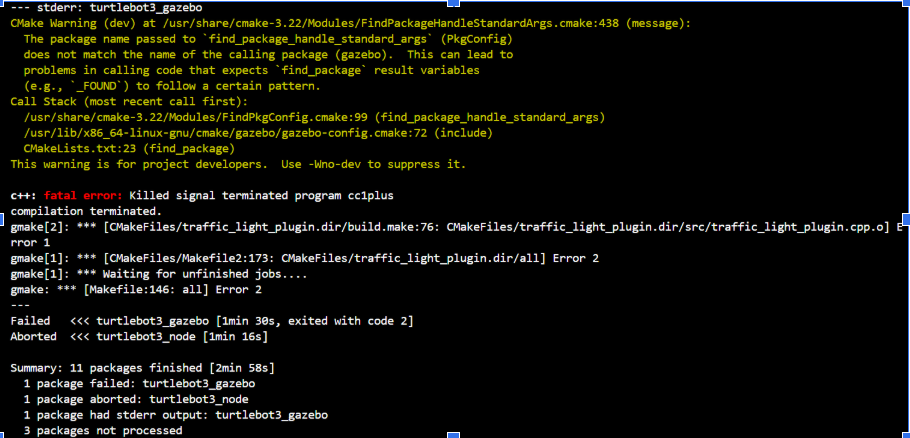
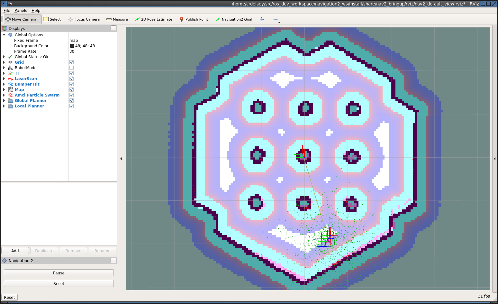

# Turtlebot3 autonomous navigation

This project demonstrates autonomous navigation for TurtleBot3 using **ROS 2 Humble**, **Nav2**, and **Gazebo simulation**.  
The robot navigates to multiple target destinations using a custom Python script based on `nav2_simple_commander`.

The project is designed to run inside a **Docker container** so it can be used on Windows without a Linux installation.

---


# Requirements

Docker desktop (for Windows)

VS code

XLaunch (for Gazebo GUI, example: VcXsrv X Server)

# Build the container
Go to the dockerfiles folder, build and start turtlebot3 container from there:

```
docker compose up -d --build
```
Once container is built, go inside it:
```
docker exec -it turtlebot3 bash
```

Build packages in the root of the workspace:
```
colcon build --symlink-install
```
Symlink install will allow to change files inside the packages without need to recompile all the time

# Troubleshooting

If there are problems while building the packages:



Then try to build using this command instead:
```
colcon build --parallel-workers 8
```
This will reduce the amount of packages built at the same time if your RAM is not fast enough, but without-symlink-install you will have to recompile everytime you change python script

If there are still issiues with the turtlebot3_gazebo package, set up the environment variables for Gazebo simulator:
```
source /usr/share/gazebo/setup.sh
```
Finally, to be able to use ros commands, source again after building packages one more time:
```
source install/setup.bash
```
Last source command is required for every open terminal.

# Launch the simulation world

Before launching gazebo simulation it is necessary to choose the model of turtlebot. For the purpose of this assignment burger model of turtlebot3 was used. Command is also necessary for each terminal.
```
export TURTLEBOT3_MODEL=burger
```
Before this step make sure XLaunch app is open and running in the background. Launch the gazebo simulation in one terminal:
```
ros2 launch turtlebot3_gazebo turtlebot3_world.launch.py
```
In the second terminal launch turtlebot3 navigation stack:
```
ros2 launch turtlebot3_navigation2 navigation2.launch.py slam:=False
```
This command allows turtlebot navigate autonomously in a known environment. Map was build in advance.

# Troubleshooting

If there is a similar error:
```
[ERROR] [tf_help]: Transform data too old when converting from map to odom
```
Then, include simulated clock published in a /clock topic instead of computer's time:
```
ros2 launch turtlebot3_navigation2 navigation2.launch.py slam:=False use_sim_time:=True
```

# Define initial position of the turtlebot in rviz

Also, it is important to define initial position of the robot before it starts navigating. For that press 2D pose estimate in Rviz and set the arrow to the place where robot is located in gazebo. Should look similar to the picture:


Once the initial pose is set, the transform tree will be complete and Nav2 will be fully active and ready to go. You should see the robot and particle cloud now like this:




# Run the python script

In the third terminal go to the `turtlebot3_navigation/scripts` folder run `test_nav2_to_pose` to move robot to one pose or run `test_nav2_waypoints` to move robot to multiple destinations. 


# Design of the application class

Both test files use the Nav2ToPose class imported from `nav2_to_pose` file. The application class consists of 3 public methods: 

* `list_to_posestamped`(which converts x,y coordinates to PoseStamped object)

* `go_to_pose`(go the one goal pose)

* `follow_waypoints`(go the the several destinations)

# Define multiple destination points 

List of destinations was created by first running following command in the terminal: 
```
ros2 topic echo /clicked_point
```
And using publish point button in Rviz. After pressing the button the coordinates of the chosen point will be demonstrated in the terminal.

# For developer

Use black formatter and Google Style.


